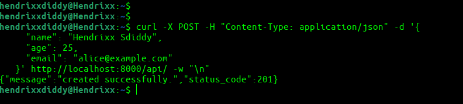
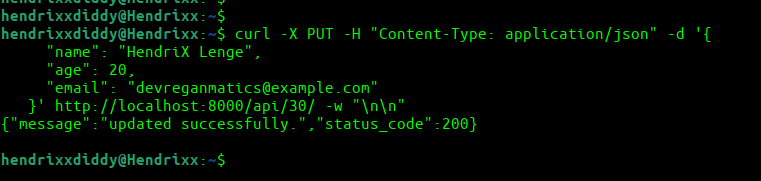
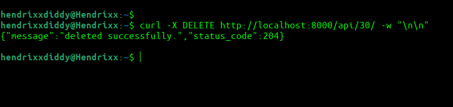
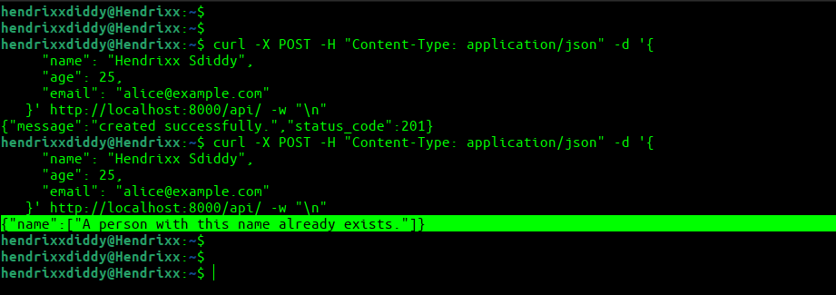
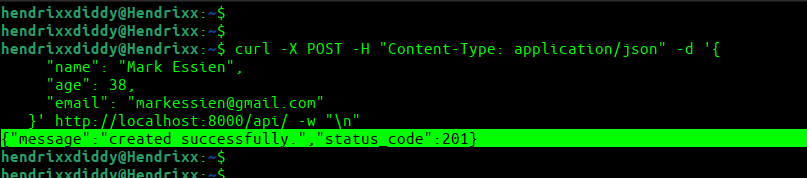
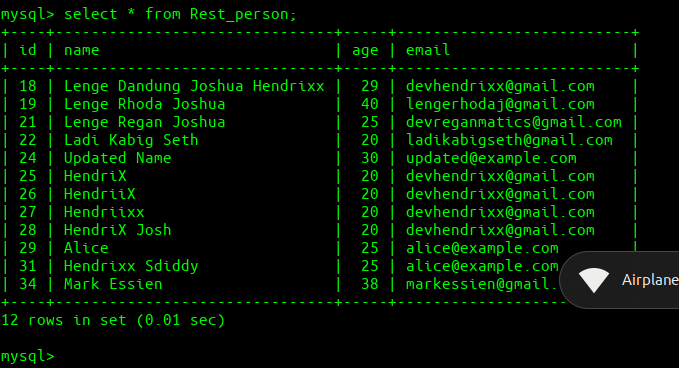
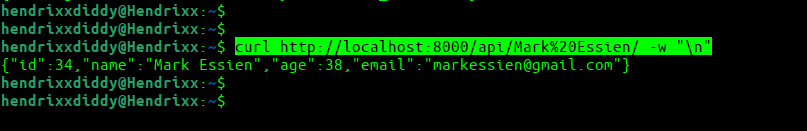

# Django REST API  Documentation

## Overview

This documentation provides information on how to use the Django REST API for managing "Person" records. The API allows you to perform CRUD (Create, Read, Update, Delete) operations on person records.

## Table of Contents

1. [Setup](#setup)
2. [API Endpoints](#api-endpoints)
   - [Create a Person](#create-a-person)
   - [Fetch Details of a Person](#fetch-details-of-a-person)
   - [Update a Person](#update-a-person)
   - [Delete a Person](#delete-a-person)
3. [Request/Response Formats](#request-response-formats)
4. [Sample Usage](#sample-usage)
5. [Known Limitations](#known-limitations)

## Setup

To use the Django REST API, follow these setup instructions:

1. Clone the repository from GitHub:

   ```bash
   git clone <repository_url>
   cd <repository_directory>

2. Create a virtual environment and activate it

   ```bash
   python -m venv venv
   source venv/bin/activate
   ```

3. Install the required dependencies:
   ```bash
   pip install -r requirements.txt

4. Apply database migrations:
   ```bash
   python manage.py migrate

The API will be accessible at **'http://localhost/api/'**

## API Endpoints

### Creates a Person
- **Endpoint: `/api/`**
- **HTTPMethod: POST**
- **Request Format:**
   
   ```json
   {
    "name": "HendriX",
    "age": 30,
    "email": "HendriX@example.com"
   }
- **Response Format:**

   ```json
   {
    "message": "Person created successfully.",
    "status_code": 201
   }

### Fetch Details od a Person
- **Endpoint: `/api/<id>/` or `/api/<name>/`**
- **HTTPMethod: GET**
- **Response Format:**

   ```json
   {
    "id": 1,
    "name": "HendriX",
    "age": 30,
    "email": "HendriX@example.com"
   }

### Update a Person
- **Endpoint: `/api/<id>/`**
- **HTTPMethod: PUT**
- **Request Format:**

   ```json
   {
    "name": "HendriX Jnr",
    "age": 35,
    "email": "HendriX@example.com"
   }

- **Response Format:**

   ```json
   {
    "message": "updated successfully.",
    "status_code": 200
   }

### Delete a Person
- **Endpoint: `/api/<id>/`**
- **HTTPMethod: DELETE**
- **Response Format:**

   ```json
   {
    "message": "deleted successfully.",
    "status_code": 204
   }

## Request/Response Formats

- All **requests** and **response** are in JSON format
- Request data are [or should be] sent in the request body as JSON
- Response data are[or should be] returned/recieved as JSON

## Sample Usage

Here are some sample API usage scenarios:
##### *Note: make sure you have your server running*

### Create a Person

   ```bash
   curl -X POST -H "Content-Type: application/json" -d '{
     "name": "Hendrixx Sdiddy",
     "age": 25,
     "email": "alice@example.com"
   }' http://localhost:8000/api/ -w "\n"
   ```

- **Response:**

  

### Fetch Details of a Person

   ```bash
   curl http://localhost:8000/api/30/ -w "\n"
   ```

- **Response:**

  

### Update a Person

   ```bash
   curl -X PUT -H "Content-Type: application/json" -d '{
     "name": "HendriX Lenge",
     "age": 20,
     "email": "devreganmatics@example.com"
   }' http://localhost:8000/api/30/ -w "\n\n"
   ```

- **Response:**

  

### Delete a Person

   ```bash
   curl -X DELETE http://localhost:8000/api/30/ -w "\n\n"
   ```

- **Response:**

  

### More...
- if you try to Create the same Person object again with the same name, you will get this:

  

- #### Dynamic Parameter Handling
  I have created a new `Person` object `Mark Essien`

  

  And from MySQL Record, `Mark Essien` is `id: 34`

  

  after passing `Mark Essien` to the API URL, it does just as specified. it retrieves the record from the database.

  


## Limitations
- The API does not support batch operations.
- Authentication and authorization mechanisms are not implemented in this sample.
- Input validation checks for string fields only; other data types are not allowed.
- Duplicate name validation is performed only during creation, not during updates.

## Roll Up
this API was extensively tested with postman and a request.py script also provided in the repository:x

## UML Diagram
you can view it [here](UML_Diagram.png)
